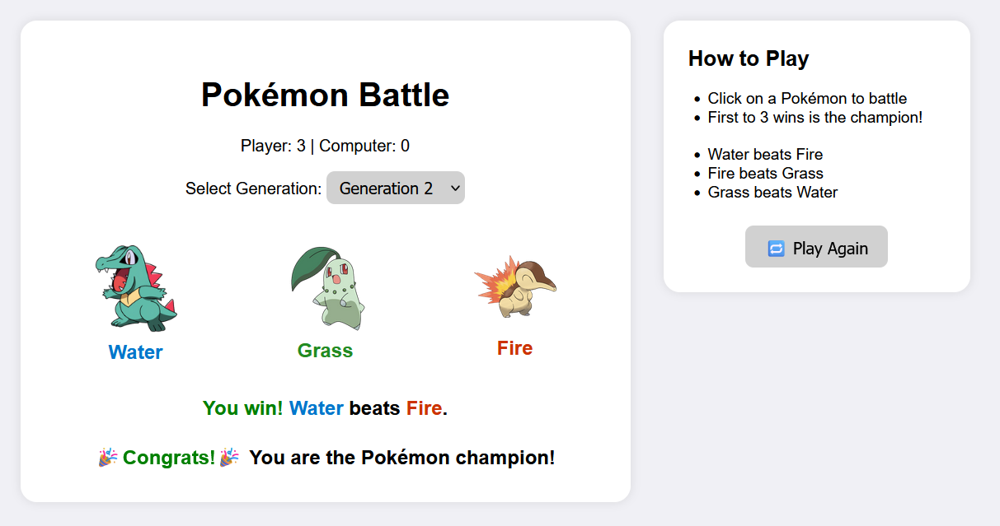

# PokémonRPS Water-Grass-Fire Pokémon Battle

A fun and interactive browser game based on the classic Rock-Paper-Scissors game. Featuring Pokémon types: Water, Grass, and Fire. Built using HTML, CSS, and JavaScript.

## 🎮 Features

- Water > Fire > Grass > Water logic
- Clickable images for player choices
- Shake animation on selection
- Random computer opponent
- Live score tracking
- Responsive design (mobile-friendly)
- Instruction box for new players
- First to 3 wins logic
- Play again button to reset game

## 🖼️ Preview



## 🚀 Getting Started

### Click the link below to play:  
https://hnguyen169.github.io/PokemonRPS/

### Or you can run locally by following these steps:  
### 1. Clone the Repository
```bash
git clone https://github.com/hnguyen169/PokemonRPS.git
cd PokemonRPS
```

### 2. Run Locally

Open index.html in your web browser.

Begin battling!

## 📌 Future Improvements

- Add sound effects (Pokémon sounds)

- Add high score and leaderboard system

- Add animation for battling

- Add animation for win/loss

- Add switching between generations (more Pokémon)
